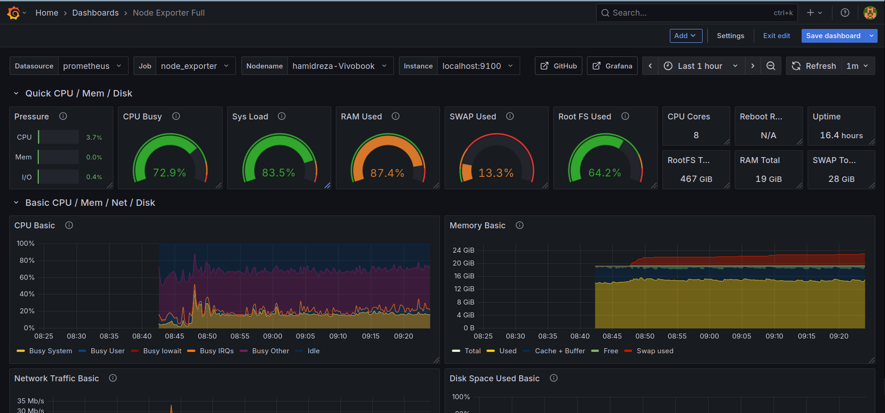

---

# 📊 Monitoring System with Prometheus, Node Exporter, and Grafana on Ubuntu




This guide explains how to set up a full monitoring stack on Ubuntu, including **Prometheus**, **Node Exporter**, and **Grafana**.

The setup will:

* Run all services as **systemd services** (auto-start after reboot).
* Collect system metrics (CPU, RAM, disk, network, etc.).
* Visualize them in Grafana with a prebuilt dashboard (ID `1860`).

---

## 🛠️ Prerequisites

* Ubuntu 22.04/24.04 (or similar).
* `sudo` privileges.
* Internet connection.

---

## 1️⃣ Install Node Exporter

Node Exporter exposes system metrics on port `9100`.

```bash
wget https://github.com/prometheus/node_exporter/releases/download/v1.8.2/node_exporter-1.8.2.linux-amd64.tar.gz
tar xvf node_exporter-*.tar.gz
sudo cp node_exporter-*/node_exporter /usr/local/bin/
```

Create a **systemd service**:

```bash
sudo tee /etc/systemd/system/node_exporter.service <<EOF
[Unit]
Description=Prometheus Node Exporter
Wants=network-online.target
After=network-online.target

[Service]
User=nobody
ExecStart=/usr/local/bin/node_exporter
Restart=always
RestartSec=5s

[Install]
WantedBy=multi-user.target
EOF
```

Enable & start:

```bash
sudo systemctl daemon-reload
sudo systemctl enable --now node_exporter
```

Test:

```bash
curl http://localhost:9100/metrics | head
```

---

## 2️⃣ Install Prometheus

Download and extract Prometheus into `/opt`:

```bash
cd /opt
wget https://github.com/prometheus/prometheus/releases/download/v2.55.1/prometheus-2.55.1.linux-amd64.tar.gz
tar xvf prometheus-*.tar.gz
mv prometheus-* prometheus
```

Create a Prometheus user and storage directory:

```bash
sudo useradd --no-create-home --shell /bin/false prometheus
sudo mkdir -p /var/lib/prometheus
sudo chown -R prometheus:prometheus /var/lib/prometheus
sudo chown -R prometheus:prometheus /opt/prometheus
```

---

### Prometheus Configuration

File: `/opt/prometheus/prometheus.yml`

```yaml
global:
  scrape_interval: 15s

scrape_configs:
  - job_name: "prometheus"
    static_configs:
      - targets: ["localhost:9090"]

  - job_name: "node_exporter"
    static_configs:
      - targets: ["localhost:9100"]
```

---

### systemd Service for Prometheus

```bash
sudo tee /etc/systemd/system/prometheus.service <<EOF
[Unit]
Description=Prometheus Monitoring
Wants=network-online.target
After=network-online.target

[Service]
User=prometheus
Group=prometheus
Type=simple
ExecStart=/opt/prometheus/prometheus \
  --config.file=/opt/prometheus/prometheus.yml \
  --storage.tsdb.path=/var/lib/prometheus \
  --web.listen-address=:9090
Restart=always
RestartSec=5s
LimitNOFILE=65536

[Install]
WantedBy=multi-user.target
EOF
```

Enable & start:

```bash
sudo systemctl daemon-reload
sudo systemctl enable --now prometheus
```

Test:

```bash
curl http://localhost:9090/metrics | head
```

---

## 3️⃣ Install Grafana

Remove old installations (if needed):

```bash
sudo apt remove --purge grafana -y
sudo rm -rf /var/lib/grafana /etc/grafana /var/log/grafana
```

Install Grafana OSS:

```bash
sudo apt update
sudo apt install -y apt-transport-https software-properties-common wget
wget -q -O - https://packages.grafana.com/gpg.key | sudo apt-key add -
echo "deb https://packages.grafana.com/oss/deb stable main" | sudo tee /etc/apt/sources.list.d/grafana.list
sudo apt update
sudo apt install grafana -y
```

Enable & start:

```bash
sudo systemctl enable --now grafana-server
```

Access Grafana:

```
http://localhost:3000
```

Default login:

```
Username: admin
Password: admin
```

---

## 4️⃣ Configure Grafana Data Source

1. Go to **Grafana → Connections → Data Sources → Add data source**.
2. Select **Prometheus**.
3. Set URL:

   ```
   http://localhost:9090
   ```
4. Click **Save & Test**.

---

## 5️⃣ Import Prebuilt Dashboard

* Go to **Grafana → Dashboards → Import**.
* Enter Dashboard ID: `1860`.
* Select your Prometheus data source.
* Click **Import**.

You will now see CPU, Memory, Disk, and Network metrics.

---

## ✅ Verification

* Node Exporter: [http://localhost:9100/metrics](http://localhost:9100/metrics)
* Prometheus: [http://localhost:9090](http://localhost:9090)
* Grafana: [http://localhost:3000](http://localhost:3000)

---

## 📦 Summary

* **Node Exporter** → Collects system metrics.
* **Prometheus** → Scrapes metrics and stores time-series data.
* **Grafana** → Visualizes metrics via dashboards.
* All services are **systemd managed** and start automatically after reboot.

